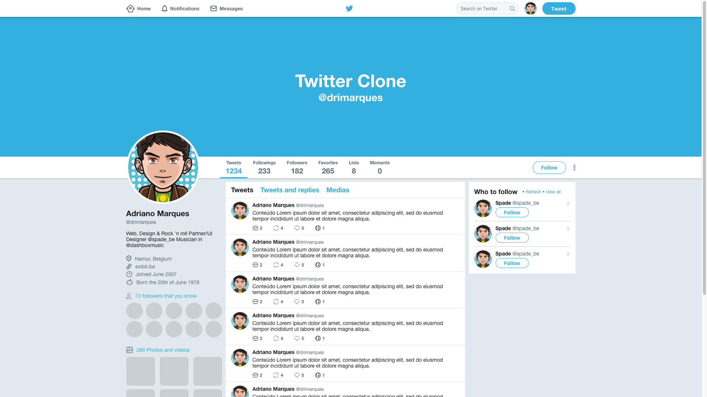

# Twitter Layout Clone

Practicing [Flexbox](https://css-tricks.com/snippets/css/a-guide-to-flexbox/) in [Twitter](https://twitter.com/) [timeline layout](https://www.sketchappsources.com/free-source/3114-twitter-profile-template-sketch-freebie-resource.html), project developed in the course of [RocketSeat](https://github.com/RocketSeat).

